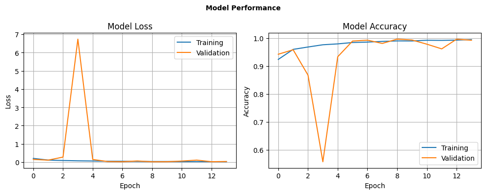
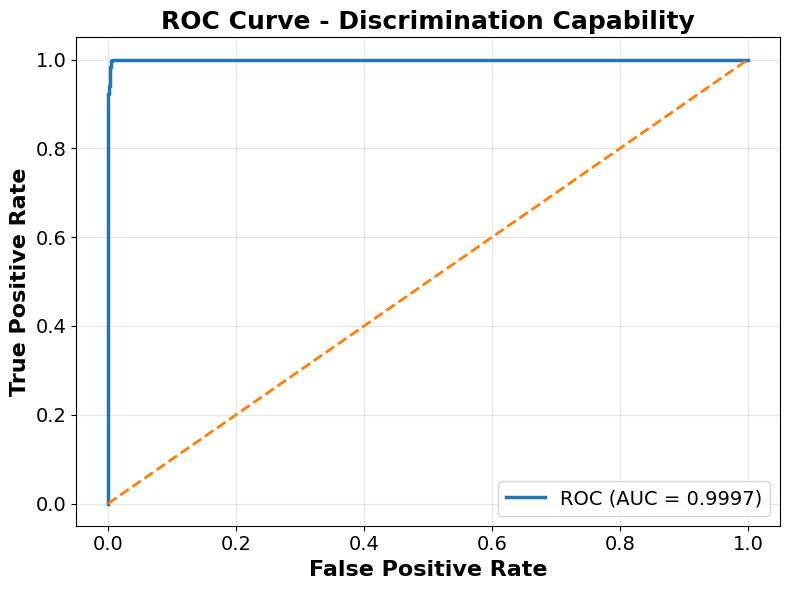

# CNN Trimodal para Estacionamiento Autónomo de Emergencia

**Sistema de Visión Artificial Multimodal para la Clasificación de Espacios de Estacionamiento Seguros en Entornos No Convencionales**

[](https://www.python.org/)
[](https://www.tensorflow.org/)
[](https://opencv.org/)
[](https://scikit-learn.org/)

---

## Descripción

Este repositorio contiene el código para entrenamiento y evaluación de una **Red Neuronal Convolucional (CNN) trimodal** así como tambien los resultados de la prueba realizada, esta CNN fue diseñada para clasificar espacios de estacionamiento como **seguros o no seguros** para un vehículo autónomo que opera en entornos no convencionales (carreteras en zonas montañosas, carretras con obstaculos negativos y vegetación a su alrededor).

El sistema combina información proveniente de tres modalidades de percepción:

- **Cámara RGB**
- **LiDAR 1**
- **LiDAR 2**

La propuesta utiliza **fusión intermedia de características**, donde cada modalidad es procesada mediante una rama convolucional independiente y posteriormente sus representaciones se combinan antes de realizar la clasificación final.

El sistema fue desarrollado como parte de un proyecto de investigación de la **Maestría en Inteligencia Artificial de la Universidad Tecnológica de la Mixteca (UTM)**.

---

## Objetivo

La investigación aborda la identificación de espacios seguros para estacionamiento en entornos donde no existe infraestructura convencional de estacionamiento, particularmente en escenarios como:

- Caminos montañosos.
- Carreteras con pendientes.
- Caminos cercanos a barrancos o desniveles.
- Entornos donde un vehículo autónomo necesita seleccionar una ubicación segura para detenerse.

El sistema se plantea como un componente de percepción para un escenario de **estacionamiento autónomo de emergencia**, donde el vehículo debe ser capaz de identificar un espacio adecuado para detenerse cuando el conductor no puede continuar controlándolo.

> **Nota:** Este proyecto corresponde a un prototipo de investigación y sus resultados experimentales. No representa un sistema de conducción autónoma listo para producción.

---

## Arquitectura del sistema

El sistema utiliza una arquitectura CNN trimodal basada en **fusión intermedia de características**.

Cada muestra del dataset está compuesta por tres observaciones sincronizadas: una imagen RGB y dos representaciones provenientes de sensores LiDAR. Estas entradas mantienen una correspondencia entre sí, ya que representan la misma escena y el mismo instante de adquisición.

```text
                 Muestra trimodal sincronizada
                           │
             ┌─────────────┼─────────────┐
             ▼             ▼             ▼
        Cámara RGB      LiDAR 1       LiDAR 2
             │             │             │
             ▼             ▼             ▼
          Rama CNN       Rama CNN       Rama CNN
             │             │             │
             ▼             ▼             ▼
       Conv + Pooling Conv + Pooling Conv + Pooling
             │             │             │
             ▼             ▼             ▼
       Características Características Características
             │             │             │
             ▼             ▼             ▼
            GAP2D         GAP2D          GAP2D
             │             │             │
             ▼             ▼             ▼
       Vector reducido Vector reducido Vector reducido
             │             │             │
             ▼             ▼             ▼
           Dense          Dense           Dense
             │             │             │
             └─────────────┼─────────────┘
                           ▼
                 Vectores homogéneos
                           │
                           ▼
                  Fusión intermedia
                           │
                           ▼
                    Clasificación
                           │
                    ┌──────┴──────┐
                    ▼             ▼
                 Seguro       No seguro
                    S              N
```
Cada modalidad es procesada inicialmente de forma independiente para extraer características relevantes. Posteriormente, estas características son combinadas mediante una estrategia de **fusión intermedia**.

---

## Modalidades de entrada

| Modalidad | Descripción |
|---|---|
| Cámara RGB | Representación visual del entorno |
| LiDAR 1 | Información espacial representada como imagen |
| LiDAR 2 | Representación LiDAR complementaria |
| Fusión | Integración de las características extraídas |

---

## Dataset

El modelo fue entrenado y evaluado utilizando un **dataset trimodal sintético generado en CoppeliaSim**.

El dataset contiene muestras sincronizadas correspondientes a las tres modalidades:

```text
Dataset/
├── Entrenamiento/
├── Validacion/
└── Prueba/
```

Cada partición contiene dos clases:

```text
N → No seguro
S → Seguro
```

El proceso de generación del dataset se encuentra separado de este repositorio pero en el mismo perfil.

---

## Modelo

El modelo final utiliza tres ramas convolucionales, una para cada modalidad, seguidas de una etapa de fusión intermedia.

Los principales componentes de la arquitectura son:

- Capas convolucionales (`Conv2D`)
- MaxPooling
- Batch Normalization
- Dropout
- Global Average Pooling 2D (`GAP2D`)
- Capas Dense
- Activación ReLU
- Salida Sigmoid

### Dimensiones de entrada

| Modalidad | Dimensión |
|---|---:|
| Cámara RGB | `640 × 640 × 3` |
| LiDAR 1 | `19 × 36` |
| LiDAR 2 | `19 × 36` |

La salida final corresponde a una clasificación binaria entre espacios **seguros** y **no seguros**.

---

## Configuración del entrenamiento

La configuración principal utilizada para el entrenamiento fue:

```text
Épocas:              30
Batch size:          16
Optimizador:         Adam
Learning rate:       0.001
```

El proceso de entrenamiento incluyó validación y técnicas de aumento de datos.

---

## Resultados

El modelo final obtuvo los siguientes resultados sobre el conjunto de prueba:

| Métrica | Resultado |
|---|---:|
| Accuracy | **0.9960** |
| Precision | **0.9957** |
| Recall | **0.9962** |
| F1-Score | **0.9959** |
| AUC-ROC | **0.9997** |

### Matriz de confusión

La matriz de confusión obtenida fue:

```text
                  Predicción
                N          S

Real N        1898         8
Real S           7      1840
```

La representación gráfica se encuentra en:

```text
results/confusion_matrix/confusion_matrix.png
```

---

## Rendimiento durante el entrenamiento

La evolución de las métricas de entrenamiento y validación se encuentra en:

```text
results/figures/training_history.png
```



---

## Curva ROC

La evaluación mediante la curva ROC obtuvo un **AUC de 0.9997**.

La gráfica se encuentra en:

```text
results/figures/roc_curve.png
```



---

## Resultados de evaluación

Las métricas principales se almacenan también en un formato estructurado:

```text
results/
└── metrics/
    └── metrics.json
```

## Estructura del repositorio

```text
CNN-Trimodal-Autonomous-Parking/
│
├── README.md
├── requirements.txt
│
├── app/
│   └── # Aplicación interactiva
│
├── docs/
│   └── # Documentación del proyecto
│
├── models/
│   └── historial_entrenamiento.json
│
├── results/
│   ├── confusion_matrix/
│   │   └── confusion_matrix.png
│   │
│   ├── figures/
│   │   ├── training_history.png
│   │   └── roc_curve.png
│   │
│   └── metrics/
│       └── metrics.json
│
└── src/
    ├── training/
    │   └── Estacionado_de_Emergencía.ipynb
    │
    ├── evaluation/
    │
    └── inference/
```

---

## Tecnologías utilizadas

### Programación

- Python
- NumPy
- JSON

### Inteligencia Artificial

- TensorFlow
- Keras
- Scikit-learn

### Visión Artificial

- OpenCV

### Visualización

- Matplotlib
- Seaborn

### Simulación

- CoppeliaSim

---

## Reproducción de los experimentos

### 1. Clonar el repositorio

```bash
git clone https://github.com/PacoHdzOsorio/CNN-Trimodal-Autonomous-Parking.git
cd CNN-Trimodal-Autonomous-Parking
```

### 2. Crear un entorno virtual

```bash
python -m venv venv
```

En Windows:

```bash
venv\Scripts\activate
```

### 3. Instalar las dependencias

```bash
pip install -r requirements.txt
```

### 4. Configurar el dataset

El dataset no está incluido en este repositorio.

Antes de ejecutar el notebook, debe configurarse la ruta local del dataset siguiendo la estructura descrita en la sección **Dataset**.

### 5. Ejecutar el notebook

El notebook principal se encuentra en:

```text
src/training/Estacionado_de_Emergencía.ipynb
```

---

## Flujo general del proyecto

```text
                 CoppeliaSim
                      │
                      ▼
            Generación del dataset
                      │
                      ▼
             Preprocesamiento
                      │
          ┌───────────┼───────────┐
          ▼           ▼           ▼
       Cámara       LiDAR 1     LiDAR 2
          │           │           │
          ▼           ▼           ▼
       CNN           CNN         CNN
          │           │           │
          └───────────┼───────────┘
                      │
                      ▼
              Fusión intermedia
                      │
                      ▼
                 Clasificación
                      │
             ┌────────┴────────┐
             ▼                 ▼
          Seguro            No seguro
             │                 │
             └────────┬────────┘
                      ▼
                  Evaluación
                      │
        ┌─────────────┼─────────────┐
        ▼             ▼             ▼
     Métricas      Matriz          Curva
                  confusión         ROC
```

---

## Contexto académico

Este repositorio forma parte de un proyecto de investigación desarrollado durante la:

**Maestría en Inteligencia Artificial**  
**Universidad Tecnológica de la Mixteca (UTM)**

### Área de investigación

**Visión Artificial y Sistemas Autónomos**

---

## Autor

**Ing. Jorge Francisco Hernández Osorio**

Maestría en Inteligencia Artificial  
Universidad Tecnológica de la Mixteca
